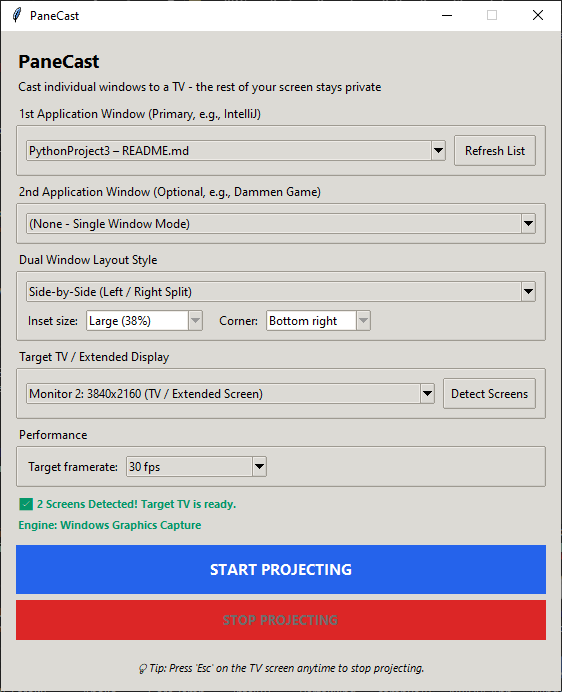
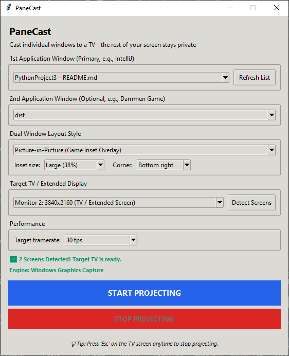

# PaneCast

Mirror one or two specific application windows onto a second display — a TV, a
projector, or any extended monitor — without mirroring your whole desktop.

Unlike `Win + P` screen duplication, PaneCast captures **individual
windows**. Your email, notifications and browser tabs stay private on your
laptop while only the window(s) you chose appear on the big screen.

> **Platform support:** Windows is fully supported and tested. macOS and
> Linux backends exist but are **experimental and unverified on real
> hardware** - see [Platform support](#platform-support).

---

## Features

- **Per-window capture** — project a specific app, not the entire desktop.
- **Dual-window projection** — show two applications at once.
- **Three layout modes** — side-by-side, top/bottom, or picture-in-picture.
- **Isolated capture** — captured windows keep rendering correctly even when
  covered by other windows or moved off-screen.
- **Child-canvas detection** — automatically finds the real rendering surface
  inside a host window (e.g. a Java/AWT or OpenGL canvas), so games and IDEs
  capture cleanly instead of showing a blank frame.
- **DPI-correct** — per-monitor DPI awareness keeps pixels 1:1 on mixed-DPI
  setups.
- **Configurable framerate** — cap the render loop at 15, 30 or 60 fps to trade
  smoothness for CPU, or run unlimited.
- **Adjustable picture-in-picture** — put the inset in any corner at 25%, 33%,
  38% or 50% of the screen.
- **Remembers your setup** — window, display, layout and framerate choices are
  restored the next time you launch.
- **Press `Esc` or `q`** on the projected screen to stop at any time.

## Screenshot

<p align="center">
  
</p>

The whole app is one window. Pick what to project, choose how to lay it out,
select the target display, and press the button. The chosen windows appear on
the TV; nothing else does.

---

## Get started

Find your platform below.

| Your system | What to do | Status |
| --- | --- | --- |
| **Windows 10 / 11** | [Download the ready-made app](#windows) — no setup | Supported and tested |
| **macOS** | [Run from source](#macos) | Experimental, unverified |
| **Linux (X11)** | [Run from source](#linux-x11) | Experimental, unverified |
| **Linux (Wayland)** | [Not supported](#linux-wayland) — switch to an X11 session | Not supported |

Everything needs **two displays**, with the second one set to *Extend* rather
than *Duplicate*.

---

### Windows

**The easy way.** Download one file and run it — no Python, no setup:

> ### [⬇ Download PaneCast.exe](https://github.com/fbugri-rgb/PaneCast/releases/latest)
>
> ~29 MB · Windows 10 (1903 or newer) and Windows 11

Windows SmartScreen will warn you the first time, because the file is not
code-signed. Click **More info → Run anyway**. If you would rather not run a
prebuilt binary, use the source route below instead.

**From source**, if you prefer:

```bash
git clone https://github.com/fbugri-rgb/PaneCast.git
cd PaneCast

python -m venv .venv
.venv\Scripts\activate

pip install -r requirements.txt
python panecast.py
```

Your Python **must** include Tcl/Tk — it is a checkbox in the official
installer labelled *"tcl/tk and IDLE"*. If it was unchecked, PaneCast cannot
start; see [Troubleshooting](#troubleshooting) for the fix.

| Reference | |
| --- | --- |
| Capture backend | [`backends/windows.py`](backends/windows.py) |
| Dependencies | [`requirements.txt`](requirements.txt) |
| Fast capture engine | [`windows-capture`](https://pypi.org/project/windows-capture/) — optional, but without it PaneCast uses a slower fallback |

---

### macOS

> **Experimental.** This backend is written but has never been run on a Mac.
> Expect rough edges, and please
> [open an issue](https://github.com/fbugri-rgb/PaneCast/issues) with what you
> find. There is no prebuilt `.app` yet.

```bash
git clone https://github.com/fbugri-rgb/PaneCast.git
cd PaneCast

python3 -m venv .venv
source .venv/bin/activate

pip install -r requirements.txt
python3 panecast.py
```

**You must grant Screen Recording permission**, or macOS quietly hands back
images of your wallpaper instead of the window you picked — with no error:

**System Settings → Privacy & Security → Screen Recording** → enable it for your
terminal (or for PaneCast), then restart the app.

| Reference | |
| --- | --- |
| Capture backend | [`backends/macos.py`](backends/macos.py) |
| Dependencies | [`requirements.txt`](requirements.txt) |
| Required package | [`pyobjc-framework-Quartz`](https://pypi.org/project/pyobjc-framework-Quartz/) — installed automatically by the command above |

---

### Linux (X11)

> **Experimental.** This backend is written but has never been run on a Linux
> desktop. Expect rough edges, and please
> [open an issue](https://github.com/fbugri-rgb/PaneCast/issues) with what you
> find.

```bash
git clone https://github.com/fbugri-rgb/PaneCast.git
cd PaneCast

python3 -m venv .venv
source .venv/bin/activate

pip install -r requirements.txt
python3 panecast.py
```

If Python complains that `tkinter` is missing, install it from your package
manager — it ships separately from Python on most distributions:

```bash
sudo apt install python3-tk      # Debian / Ubuntu
sudo dnf install python3-tkinter # Fedora
sudo pacman -S tk                # Arch
```

Keep a compositing manager running, otherwise windows hidden behind others may
capture as blank or stale.

| Reference | |
| --- | --- |
| Capture backend | [`backends/linux.py`](backends/linux.py) |
| Dependencies | [`requirements.txt`](requirements.txt) |
| Required package | [`python-xlib`](https://pypi.org/project/python-xlib/) — installed automatically by the command above |

---

### Linux (Wayland)

**Not supported, and not an oversight.** Wayland deliberately prevents one
application from reading another's pixels, so there is no way to capture a
window the way PaneCast needs to. PaneCast detects a Wayland session and tells
you, rather than silently showing black.

Check which session you are in:

```bash
echo $XDG_SESSION_TYPE     # prints "wayland" or "x11"
```

To use PaneCast today, log out and pick an **X11 / Xorg** session at the login
screen. Applications running under XWayland are capturable from an X11 session.

Proper Wayland support means PipeWire via `xdg-desktop-portal` — it is
[on the roadmap](#roadmap).

---

### Common requirements

| | |
| --- | --- |
| Python | 3.9 or newer (only needed when running from source) |
| Tcl/Tk | Required — bundled with Python on Windows and macOS, a separate package on Linux |
| Displays | At least two, with the second set to **Extend** |

## Usage

```bash
python panecast.py
```

1. Set your second display to **Extend** (`Win + P` → *Extend*).
2. Pick the window you want to project under **1st Application Window**.
   Click **🔄 Refresh List** if you opened it after launching.
3. Optionally pick a second window and choose a **layout style**.
4. Choose the target display under **Target TV / Extended Display**, using
   **🔄 Detect Screens** if it isn't listed.
5. Click **START PROJECTING**.
6. Press **`Esc`** or **`q`** on the projected screen to stop.

### Layout modes

| Mode | Behaviour |
| --- | --- |
| **Side-by-Side** | Two windows split left / right. |
| **Top / Bottom** | Two windows stacked vertically. |
| **Picture-in-Picture** | Window 1 fills the screen; window 2 floats in a corner as an inset. |

In picture-in-picture mode the **Inset size** and **Corner** controls become
available, letting you place the inset in any of the four corners at 25%, 33%,
38% or 50% of the screen. They are greyed out in the other layouts.

<p align="center">
  
</p>

<p align="center"><em>Two windows selected, picture-in-picture chosen, with the
inset controls active.</em></p>

### Framerate

**Target framerate** caps the render loop. Frames are only redrawn when the
capture thread delivers a new one, so a lower cap costs nothing in
responsiveness but meaningfully reduces CPU. 30 fps is the default; drop to
15 fps on a laptop running on battery, or raise it if you are projecting at
1080p and want maximum smoothness.

### Saved settings

Your selections are written to `%APPDATA%\PaneCast\settings.json` when you
start projecting and when you close the app, then restored on the next launch.
A remembered window is only reselected if a window with that title is open
again; a remembered display only if it is still connected. Delete the file to
reset to defaults.

Note that the file records the *titles* of the windows you projected. It stays
on your machine, but delete it if you would rather not keep that history.

Selecting *"(None - Single Window Mode)"* for the second window projects a
single window scaled to fit, preserving aspect ratio.

---

## How it works

PaneCast uses two capture backends and prefers the faster one:

1. **Windows Graphics Capture (WGC)** — the modern, GPU-accelerated OS capture
   API, via the [`windows-capture`](https://pypi.org/project/windows-capture/)
   package. Runs on its own thread and delivers frames asynchronously. This is
   the path that keeps working when a window is occluded.
2. **`PrintWindow` (GDI)** — a pure `ctypes` fallback used when WGC is
   unavailable. It requires no extra dependencies but is slower and some
   applications refuse to render into it.

Window and monitor enumeration is done directly against the Win32 API
(`EnumWindows`, `EnumDisplayMonitors`, `DwmGetWindowAttribute`) through
`ctypes`, so there are no heavyweight GUI or automation dependencies. The
interface itself is plain `tkinter`, and captured frames are scaled with
Pillow and blitted onto a `tkinter.Canvas`.

Window bounds come from `DwmGetWindowAttribute(DWMWA_EXTENDED_FRAME_BOUNDS)`
rather than `GetWindowRect`, which avoids the invisible drop-shadow border that
would otherwise show up as a dark band around the projected window.

### Performance

Frames are only rescaled and re-uploaded when the capture thread actually
delivers a new one, so an idle projection costs almost nothing. The `PhotoImage`
for each slot is allocated once and reused via `.paste()` rather than rebuilt
per frame, and canvas `coords`/`itemconfigure` calls are skipped unless
something moved.

The remaining bottleneck is Tk itself. Pasting into a canvas-attached image
forces a synchronous redraw of the whole item, which dominates at high
resolutions:

| Output resolution | Cost per rendered frame | Practical ceiling |
| --- | --- | --- |
| 1920 x 1080 | ~20 ms | ~50 fps |
| 3840 x 2160 | ~78 ms | ~13 fps |

If your TV is 4K, setting it to 1080p for projection is by far the biggest
single win available. Genuinely high framerates at 4K would require replacing
the Tk canvas with a GPU-backed presentation surface.

---

## Platform support

Capture is isolated behind a small interface in [`backends/`](backends/), so
each platform plugs in its own implementation. `backends.get_backend()` picks
the first one that reports itself available.

| Platform | Backend | Status |
| --- | --- | --- |
| Windows 10 / 11 | Windows Graphics Capture, GDI fallback | Supported and tested |
| macOS | Quartz (`backends/macos.py`) | Experimental, **unverified** |
| Linux (X11) | X11 + Composite (`backends/linux.py`) | Experimental, **unverified** |
| Linux (Wayland) | none | Not supported by design |

### On "unverified"

The macOS and Linux backends were written against the Quartz and Xlib APIs but
have **never been executed on those platforms**. They are structurally complete
and conform to the backend interface, but expect to fix details on first contact
with real hardware. Bug reports and fixes are very welcome. PaneCast states
plainly in its own UI when it is running an experimental backend.

### Platform notes

- **macOS** needs `pyobjc-framework-Quartz` and **Screen Recording** permission
  (System Settings > Privacy & Security > Screen Recording). Without it macOS
  silently returns wallpaper-only images rather than raising. Quartz's
  `CGWindowListCreateImage` is used rather than ScreenCaptureKit: it is
  deprecated as of macOS 14 but synchronous and far simpler. ScreenCaptureKit is
  the right long-term target.
- **Linux** needs `python-xlib` and an X11/Xorg session. Capturing occluded
  windows relies on the X Composite extension, so a compositing manager should
  be running.
- **Wayland** deliberately forbids one client from reading another client's
  pixels. The sanctioned route is PipeWire via `xdg-desktop-portal`, which needs
  an interactive permission prompt per capture. PaneCast detects a Wayland
  session and says so, rather than silently capturing black frames. Apps running
  under XWayland are still capturable from an X11 session.

### Adding a backend

Subclass `CaptureBackend` in [`backends/base.py`](backends/base.py) and
implement `is_available()`, `list_windows()`, `list_monitors()`,
`window_bounds()` and `grab()`. Implementing `open_stream()` is optional: if it
returns `None`, the render loop polls `grab()` each tick instead. Then register
the class in `backends/__init__.py`.

---

## Building a standalone executable

Users then need no Python installation.

```bash
pip install pyinstaller
pyinstaller --onefile --windowed --name PaneCast --noconfirm   --exclude-module cv2   --runtime-hook pyi_rth_stub_cv2.py   panecast.py
```

The binary appears in `dist/PaneCast.exe` (~29 MB).

- `--onefile` bundles everything into a single `.exe`.
- `--windowed` suppresses the console window.
- `--exclude-module cv2` together with the runtime hook drops OpenCV, which
  `windows-capture` imports at module scope but only uses in `save_as_image()`
  — a function PaneCast never calls. Bundling it anyway costs **45 MB**
  (70 MB → 29 MB) for code that never runs. The hook installs a stub module so
  the import still succeeds. Verified: the resulting binary still reports
  `HAS_WINDOWS_CAPTURE = True` and captures live frames.

### Automated builds

Pushing a `v*` tag runs [`.github/workflows/release.yml`](.github/workflows/release.yml),
which builds the executable on a `windows-latest` runner, verifies it, and
publishes a release with the binary and its SHA256 attached:

```bash
git tag v0.2.0
git push origin v0.2.0
```

Running the workflow manually (**Actions → Build and release → Run workflow**)
performs the same build but uploads the exe as a workflow artifact instead of
publishing a release, which is useful for testing a change to the pipeline.

The workflow asserts that `HAS_WINDOWS_CAPTURE` is true and that the binary
stays under 45 MB, so a regression that silently drops the fast capture engine
or re-bundles OpenCV fails the build rather than shipping.

A code-signing step is present but disabled. To enable it, add your certificate
as the `CERT_PFX_BASE64` secret (base64-encoded PFX) and its password as
`CERT_PASSWORD`, then remove the `if: false` from the *Sign executable* step.

**PyInstaller cannot cross-compile.** A Windows `.exe` must be built on
Windows, a macOS `.app` on macOS, and a Linux binary on Linux. Once other
platforms are supported, a GitHub Actions matrix build across
`windows-latest`, `macos-latest` and `ubuntu-latest` is the usual way to
publish all three from one workflow.

> Single-file builds unpack to a temporary directory at startup, so they launch
> more slowly than `--onedir`. Some antivirus engines also flag freshly-built,
> unsigned PyInstaller binaries; code-signing the executable avoids this.

---

## Troubleshooting

**`ModuleNotFoundError: No module named 'tkinter'`**
Python was installed without Tcl/Tk. Re-run the official Python installer,
choose **Modify**, and tick *tcl/tk and IDLE*. Note that *upgrading* Python
will not add it — the installer preserves your existing feature selection, so
you must explicitly use Modify.

**"Only 1 Screen Detected"**
Press `Win + P` and choose **Extend** (not *Duplicate* or *Second screen
only*), then click **🔄 Detect Screens**.

**Projected window is black or frozen**
Some applications — particularly ones using hardware-accelerated or protected
rendering — refuse to draw into the GDI fallback. Install `windows-capture` to
enable the WGC backend, which handles most of these correctly.

**The window I want isn't in the list**
Only visible, titled, non-tool windows are listed. Click **🔄 Refresh List**
after opening the app. Minimised windows may not capture reliably.

---

## Roadmap

- [x] Cross-platform capture backend architecture
- [ ] Verify the macOS and Linux backends on real hardware
- [ ] macOS ScreenCaptureKit backend (replacing deprecated Quartz calls)
- [ ] Wayland support via PipeWire / xdg-desktop-portal
- [x] Configurable target framerate instead of a fixed timer
- [x] Remember last-used window/display selection between runs
- [x] Adjustable picture-in-picture size and corner
- [x] Automated release builds via GitHub Actions
- [ ] Code-signed binaries (needs a code-signing certificate)

## Contributing

Issues and pull requests are welcome. Capture is isolated behind the interface
in [`backends/base.py`](backends/base.py), which is the natural seam for new
platforms; see [Adding a backend](#adding-a-backend).

The most useful contribution right now is **running the macOS or Linux backend
on real hardware and reporting what breaks**. Both are written, neither has ever
been executed.

## License

Released under the MIT License — see [`LICENSE`](LICENSE).
